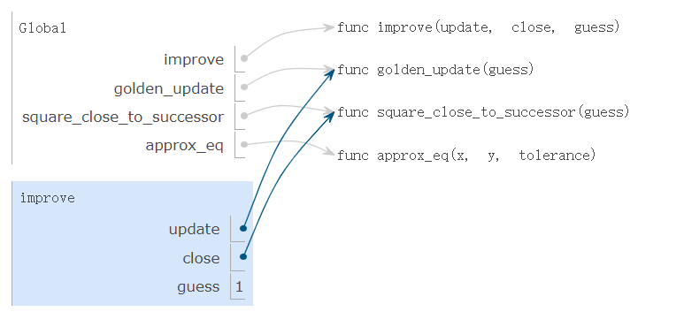
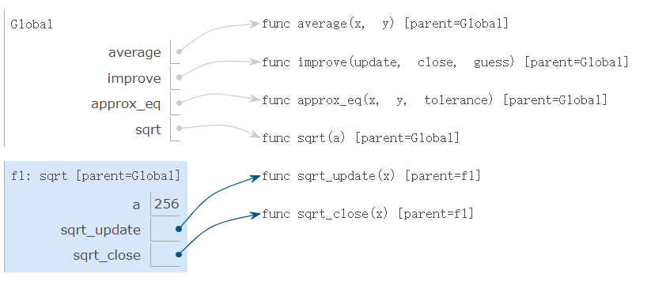
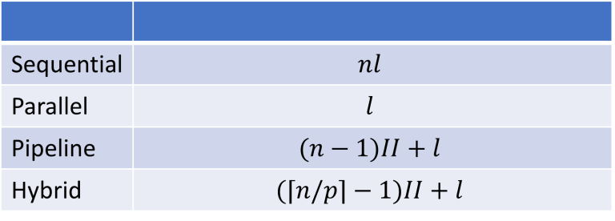

# <font size=6 face="Helvetica">1.6   Higher-Order Functions</font>

> ## Content
<!-- 内容整理 -->

函数定义使用的具体意义
lacking function definition would put us at the disadvantage of :
forcing us to work always at the level of the particular operations that happen to be primitives in the language (multiplication, in this case) rather than in terms of higher-level operations. 

Higher-Order Functions:
- can accept other functions as arguments or return functions as values


### 1.6.1   Functions as Arguments
<!-- 具体课程内容的整理 -->
<!-- 每一小节 -->

EX:数列求和 python实现
- EX1: sum_naturals, computes the sum of natural numbers up to n:  

``` python
>>> def sum_naturals(n):
        total, k = 0, 1
        while k <= n:
            total, k = total + k, k + 1
        return total
>>> sum_naturals(100)
5050
```
- EX2: sum_cubes, computes the sum of the cubes of natural numbers up to n.  

``` python
>>> def sum_cubes(n):
        total, k = 0, 1
        while k <= n:
            total, k = total + k*k*k, k + 1
        return total
>>> sum_cubes(100)
25502500
```

- EX3: pi_sum, computes the sum of terms in the series

``` python
>>> def pi_sum(n):
        total, k = 0, 1
        while k <= n:
            total, k = total + 8 / ((4*k-3) * (4*k-1)), k + 1
        return total
>>> pi_sum(100)
3.1365926848388144
```

可发现三个EX中的共同结构
``` python
def <name>(n):
    total, k = 0, 1
    while k <= n:
        total, k = total + <term>(k), k + 1
    return total
```

EX:针对返回函数 抽象方法的具体实现案例
- EX1: PI的近似值计算

``` python
>>> def summation(n, term):
        total, k = 0, 1
        while k <= n:
            total, k = total + term(k), k + 1
        return total
>>> def pi_term(x):
        return 8 / ((4*x-3) * (4*x-1))
>>> def pi_sum(n):
        return summation(n, pi_term)
>>> pi_sum(1e6)
3.141592153589902
```

### 1.6.2   Functions as General Methods

some functions express general methods of computation, independent of the particular functions they call.

EX:  compute a finite approximation to the golden ratio
gloden ratio.py
``` python
def improve(update, close, guess=1):
    while not close(guess):  #此处在close即square_close_to_successor 中绑定了 guess=1 的default value
        guess = update(guess) 
    return guess

def golden_update(guess):
    return 1/guess + 1

def square_close_to_successor(guess):
    return approx_eq(guess * guess,guess + 1)
	
def approx_eq(x, y, tolerance=1e-3):
    return abs(x - y) < tolerance
	
phi = improve(golden_update,square_close_to_successor)

```



Understanding the procedure of interpreting programs allows us to validate and inspect the process we have created.

Testing: 没有信息返回 则说明精确度符合要求 `abs(x - y) < tolerance`(条件为False时候 执行信息提示即在 if not expression 的情况下)
``` python
from math import sqrt
phi = 1/2 + sqrt(5)/2
def improve_test():
    approx_phi = improve(golden_update, square_close_to_successor)
    assert approx_eq(phi, approx_phi), 'phi differs from its approximation'
improve_test()
```

### 1.6.3   Defining Functions III: Nested Definitions

前面的例子主要都是在全局框架下定义新的函数，这样一方面要求定义函数名称的独特性，另一方面会受到特定 function signatures 函数签名的限制 带来的参数传入的限制(the update argument to improve must take exactly one argument.)

Nested Definitions 嵌套函数定义解决了上述的问题，但是对我们的 environment model 环境模型有更加具体的要求

EX: 利用嵌套定义的方法重新 定义sqrt()

update converges to the square root of a:
``` python
>>> def average(x, y):
        return (x + y)/2
>>> def sqrt_update(x, a):
        return average(x, a/x)s
```

对比前面定义 求 gloden radio 的方法 如果直接在local frame 定义 sqrt_update 则需要向 improve 函数传入两个参数 而improve 函数只能接受到一个 formal parameter ，于是通过嵌套定义的方法  把 name a 绑定到局部函数的环境内
完整 嵌套定义 sqrt()的代码：
``` python
def average(x, y):
    return (x + y)/2

def improve(update, close, guess=1):
    while not close(guess):
        guess = update(guess)
    return guess

def approx_eq(x, y, tolerance=1e-3):
    return abs(x - y) < tolerance

def sqrt(a):
    def sqrt_update(x):
        return average(x, a/x)
    def sqrt_close(x):
        return approx_eq(x * x, a)
    return improve(sqrt_update, sqrt_close)

result = sqrt(256)
```

parent frame: 定义函数的 Lexical scope 词法范围定义在他对应的 父本框架下 例如 func sqrt_update(x) [parent=f1]  


lexical scoping:
- The names of a local function do not interfere with names external to the function in which it is defined, because the local function name will be bound in the current local environment in which it was defined, rather than the global environment.
- A local function can access the environment of the enclosing function, because the body of the local function is evaluated in an environment that extends the evaluation environment in which it was defined.

### 1.6.4   Functions as Returned Values
重要  lexically scoped 特性：  
**locally defined functions maintain their parent environment when they are returned**

理解该特性的EX:define  ${h(x) = f(g(x))}$  
``` python
>>> def compose1(f, g):
        def h(x):
            return f(g(x))
        return h
```

完整案例见 txt 官网：精确定义环境模型

### 1.6.5   Example: Newton's Method
沿着切线 tangent 计算导数为0的点：过程实现
``` python
>>> def newton_update(f, df):
        def update(x):
            return x - f(x) / df(x)
        return update
```

利用improve algorithm 检验结果：
``` python
>>> def find_zero(f, df):
        def near_zero(x):
            return approx_eq(f(x), 0)
        return improve(newton_update(f, df), near_zero)

```

利用 Newton's Method 计算任意 degree 的平方根
EX1:

Generalizing:

### 1.6.6   Currying

Wiki中关于 [Currying-wiki](https://simple.wikipedia.org/wiki/Currying)
 的解释  
> that takes several arguments into a number of functions that each take one argument.  
柯里化就是把一个多元函数，转换成一系列更少元函数的处理方法

同时给出了 像 Haskell 这样的 programming languages 只能有一个变元的原因：
> Mathematicians Moses Schönfinkel[1][2][3] and Gottlob Frege laid the groundwork for this technique, which is named after Haskell Brooks Curry.[4][5] Currying is used in Lambda calculus. Some programming languages, such as ML and Haskell say that functions can only have one argument.

关于柯里化实现原理和 实现一个通用的柯里化函数：[函数式编程--柯理化（Currying）](https://zhuanlan.zhihu.com/p/355859667)

EX: 定义函数$g()$ 来等价于多元函数$f(x,y)$
we can define a function `g` such that $g(x)(y)$ is equivalent to $f(x, y).$
`g` is a higher-order function that takes in a single argument x and returns another function that takes in a single argument y. 

``` python
>>> def curried_pow(x):
        def h(y):
            return pow(x, y)
        return h

>>> curried_pow(2)(3)
8
```

EX: 通过 *map* pattern 映射关系将单参数函数对应一系列值（参考函数的映射关系定义，后续章节有相关应用
``` python
>>> def curry2(f):
        """Return a curried version of the given two-argument function."""
        def g(x):
            def h(y):
                return f(x, y)
            return h
        return g
>>> def uncurry2(g):
        """Return a two-argument version of the given curried function."""
        def f(x, y):
            return g(x)(y)
        return f
>>> pow_curried = curry2(pow)
>>> pow_curried(2)(5)
32
>>> map_to_range(0, 10, pow_curried(2))
1
2
4
8
16
32
64
128
256
512
```


#### 相关拓展  
关于对(并行式)数据处理 map pattern 在HLS的综合应用(sequential, parallel, pipelined or hybrid 顺序、并行、流水线或混合)可参考 [Map Pattern in High-Level Synthesis](https://highlevel-synthesis.com/2021/10/23/map-pattern-in-high-level-synthesis/) 同时有对应在 [udemy](https://www.udemy.com/course/hls-combinational-circuits/)平台上的在线课程  



关于HLS:  
HLS(High-Level Synthesis) 自动把高级语言综合成低级硬件描述语言的工具。 
可参考[FPGA2018 Dynamatic 高级综合工具](https://zhuanlan.zhihu.com/p/87999591#:~:text=%E9%AB%98%E7%BA%A7%E7%BB%BC%E5%90%88%EF%BC%88High-Level%20Synthesis%EF%BC%8C%E7%AE%80%E7%A7%B0%20HLS%29%20%E6%98%AF%E4%B8%80%E7%A7%8D%E8%87%AA%E5%8A%A8%E6%8A%8A%E9%AB%98%E7%BA%A7%E8%AF%AD%E8%A8%80%E7%BB%BC%E5%90%88%E6%88%90%E4%BD%8E%E7%BA%A7%E7%A1%AC%E4%BB%B6%E6%8F%8F%E8%BF%B0%E8%AF%AD%E8%A8%80%E7%9A%84%E5%B7%A5%E5%85%B7%E3%80%82%20%E8%BF%91%E5%B9%B4%E6%9D%A5%E8%A2%AB%E4%BA%BA%E4%BB%AC%E7%86%9F%E7%9F%A5%E7%9A%84%20HLS%20%E5%B7%A5%E5%85%B7%E6%9C%89%E5%B7%A5%E4%B8%9A%E7%95%8C%E6%9C%89%E5%90%8D%E7%9A%84,Xilinx%20Vivado%20HLS%20%E5%92%8C%E5%AD%A6%E6%9C%AF%E7%95%8C%E6%9C%89%E5%90%8D%E7%9A%84%20LegUp%20HLS%20Tool%20%E3%80%82)

参考论文为[Dynamically Scheduled High-level Synthesis](https://dl.acm.org/doi/10.1145/3174243.3174264) (已开源 见FPGA 2020 会议 tutorial)

### 1.6.7   Lambda Expressions
EX: return a lambda expression 
``` python
>>> def compose1(f, g):
        return lambda x: f(g(x))
```

understand the structure of a `lambda` expression:  
     lambda            x            :          f(g(x))  
"A function that    takes x    and returns     f(g(x))"

通过environment diagram 可见在调用 lambda expression 的时候和其他function 没多少本质区别 只不过没有具体的name 随后介绍了关于lambda 的词源  
关于 `lambda calculus` 可见Chapter 3

### 1.6.8   Abstractions and First-Class Functions

> The significance of higher-order functions is that they enable us to represent these abstractions explicitly as elements in our programming language, so that they can be handled just like other computational elements.  

注重在编程的时候学会识别各种底层抽象原理，并以此为基础来泛化它们以创建更强大的抽象。 并不是一味强调抽象，而是要学会注重抽象级别，根据这些抽象继续思考，来应用到新的交互环境中。高阶函数的意义在于，它们使我们能够将这些抽象明确表示为编程语言中的元素，以便可以像处理其他计算元素一样处理它们。

对 first-class elements的定义：
1. They may be bound to names.
2. They may be passed as arguments to functions.
3. They may be returned as the results of functions.
4. They may be included in data structures.


#### 相关拓展
关于first-class functions 以及在python中的实现
A language has first-class functions if it can do each of the following without recursively invoking a compiler or interpreter or otherwise metaprogramming:  
- Create new functions from preexisting functions at run-time
- Store functions in collections
- Use functions as arguments to other functions
- Use functions as return values of other functions
例如python 中的lambda function

不同编程语言的first_class_funciton 可见 [First-class functions](https://rosettacode.org/wiki/First-class_functions#Python) 


### 1.6.9   Function Decorators
EX:  @trace 的使用

>the name `triple` is not bound to this function. Instead, the name `triple` is bound to the returned function value of calling `trace` on the newly defined triple function  
相关代码可见`1.6.6EX.py`
等价于
``` python
>>> triple = trace(triple)
```
#### 相关拓展

[A guide to Python's function decorators](https://www.thecodeship.com/patterns/guide-to-python-function-decorators/)
[Python Decorators](https://www.programiz.com/python-programming/decorator): Programiz 平台
[Decorator Pattern](https://arielortiz.info/apps/s201813/tc3049/programming_decorator/)


>## Idea  
<!-- 学习过程一些疑问和思考，疏通基础内容后要尽可能解决这些疑问 -->

兼容 makedown 的latex 插件
https://www.jianshu.com/p/23b02c1708ae


<!-- 概念与概念之间的联系与区别 -->

>## Summary  
<!-- 学习过程中的总结 -->
2022.9.7 
用时1h 完成了1.6.1的整理  部分1.6.2
用时50min 完成了1.6.2 部分1.6.3内容的整理
后续安排：gloden radio 的具体实现 参考 [Gloden RATIO WORKSHEET](http://www.geom.uiuc.edu/~demo5337/s97b/worksheet.html)

1h40min 完成到1.6.5 NEWTON method的整理

2022.9.9
20min 线下课 课前浏览
1h50min 完成到1.6.9的 function decorators 整理
- Summary: 今日在上科技英语课程的时候的感想，科技英语课程中的学习情况：提前备了有关的专业词汇，以致于在后续阅读的时候如同读中文一样顺利。一方面对于这些曾经熟悉过的概念在脑海里面有具体的理解，一方面风电专业英语的教材难度确实比UCB textbook难度要低很多。然而计算机专业英语词汇本身很多概念就比较抽象，很多东西要具体实践了才能得知。所以想到接下来在阅读 教材 reading部分可以改善的角度：如何把抽象的概念用具体的事物描述起来（图标？lecutre video?

2022.9.10
10min 完成了1.6ch的整理
25min 完成了1.5ch 剩余部分的整理：
- summary:在 完成hw lab project 和 学习reading lecture video的过程中 对抽象的概念的理解是逐渐具体的 重要的还是多学习,多实践   

30min 完成了1.7.1 CH的学习：
- summary: (在编写 hog.project的时候深有体会，虽然关于迭代的思想之前在学C语言的时候有学过 但是自己现在很少具体运用过) 通过hw lab 和 reading lecutre 之间交替学习形成的反馈可以迅速保证学习到的理论能尽快投入到自己的代码中应用(同时注意多参考别人优秀代码，有时候思想很容易陷入瓶颈，这样反而提升的慢)